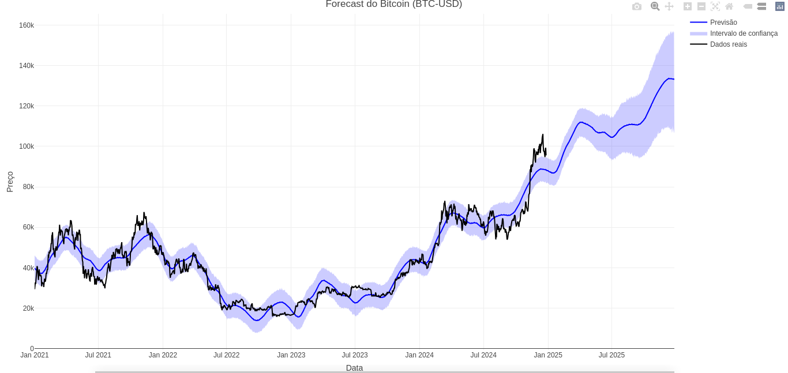
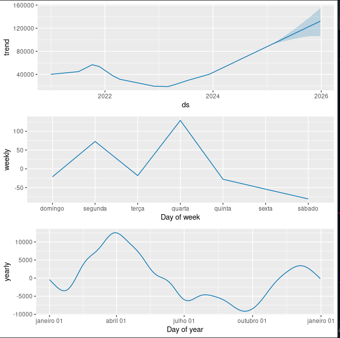

# bitcoin-price-forecast


**OBS**: O mercado de criptomoedas é complexo, volátil e sensível a variáveis externas. Logo, prever seu comportamento futuro é uma tarefa difícil. O objetivo deste projeto foi apenas colocar em prática os conceitos que aprendi recentemente sobre Séries Temporais e Ciência de Dados, sendo um experimento técnico, não financeiro.

## Resumo
- Usei a biblioteca prophet;
- Para os dados de treinamento, decidi usar dados a partir de 2021. Antes disso, a variação de preço anual era relativamente pequena e poderia influenciar a previsão. (Talvez, no futuro, eu faça testes para verificar a validade dessa hipótese);
- Em breve, planejo dividir os dados em treinamento e teste, para avaliar o desempenho do modelo;
- A previsão é para 1 ano além da data atual.


## Funcionalidades
- **Análise de preços**: Previsão de tendências e sazonalidades.
- **Visualização**: Gráficos das previsões e análise dos componentes do modelo.

## Requisitos

```r
install.packages(c("prophet", "tidyquant", "dplyr", "ggplot2", "plotly", "fpp3"))
```

## Plots Principais
### Previsão


### Componentes de tendência e sazonalidade


